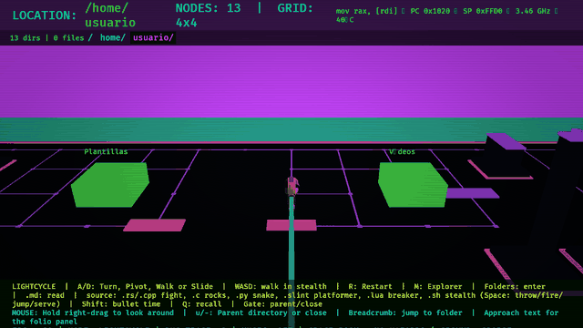

# ⚡ LIGHTRIDER

### *Realtime Abstracted Path Tree Observer & Cyber-Grid Lightcycle Navigator*

*A dangerously cool 3D filesystem explorer and TRON cyber-arcade built with Rust + Bevy, inspired by Jurassic Park's iconic FNS scene.*



> *"It's a UNIX system... I know this!"* — Lex Murphy, *Jurassic Park (1993)*

---

## 🌟 What is LIGHTRIDER?

**LIGHTRIDER** transforms your filesystem into an interactive, luminous neon-grid cyber-city. Seamlessly navigate directories in 3D, inspect and open files, ride a high-speed lightcycle through city streets, and battle inside source code files transformed into 15+ retro arcade minigames!

### Key Highlights
* 🏙️ **3D Filesystem City**: Every directory renders as an explorable 3D grid with raycast picking, smooth orbit camera, live stats, and breadcrumbs.
* 🏍️ **Lightcycle Mode**: Press `M` to seamlessly zoom from 3D Explorer into a first/third-person lightcycle ride across procedural streets leaving liquid-glass light trails.
* 🕹️ **15+ File-Based Arcade Games**: Ride into source code towers to launch arena battles generated from file bytes — **Disc Wars** (`.rs`), **Asteroid Field** (`.c`), **Snake** (`.py`), **Platformer** (`.slint`), **Brick Breaker** (`.lua`), **Stealth** (`.sh`), **River Surfer** (`.toml`), **Galaga** (`.json`), **Pac-Man** (`.go`), **Tetris** (`.yaml`), **Frogger** (`.js`), **Q*bert** (`.zig`), **Bomberman** (`.php`), and more!
* 🎵 **Synthesized Soundtrack & Title Theme**: Features an energetic 128 BPM Techno / Frutiger-Aero title theme with Daft Punk sidechain ducking, plus a deterministic procedural synthesizer powered by [Glicol](https://glicol.org) that changes based on your directory.
* 🚀 **High-Performance**: Engineered with Rust and Bevy 0.19 to render up to 30,000 files at high frame rates with zero allocations in the render loop.

---

## 📚 Documentation & Guides

Detailed guides have been organized into dedicated documentation:

| Guide | Description |
| :--- | :--- |
| 🎮 **[Controls Cheat Sheet](docs/controls.md)** | Full keybindings for Menu, Explorer, Lightcycle, and Minigames. |
| 🏍️ **[Lightcycle Mode & Cyber-City](docs/lightcycle.md)** | Driving mechanics, satellite transitions, city generation, and machine metaphors. |
| 🕹️ **[Arcade Minigames Guide](docs/games.md)** | Breakdown of all 15+ code-generated minigames and combat rules. |
| 🎵 **[Audio & Procedural Music](docs/audio.md)** | Title menu track details, Glicol synthesizer architecture, and audio controls. |
| ⚡ **[Performance & Benchmarking](docs/performance.md)** | Raster tuning, MSAA/Bloom options, `--bench` flags, and low-spec optimization. |

---

## 🚀 Quick Start

### Prerequisites
* **Rust**: Stable toolchain (`rustup update`)
* **Linux Dependencies** (for audio synthesis and windowing):
  ```bash
  sudo apt install libasound2-dev pkg-config
  ```

### Running

```bash
# Run in release mode (recommended)
cargo run --release

# Fast dev builds (uses dynamic linking)
cargo run --features dev

# Launch directly into a specific folder
cargo run --release -- /path/to/folder

# Fast preset for integrated GPUs / laptops
cargo run --release -- --fast
```

### Building for Windows
* **GitHub Actions**: Automated Windows release binaries are built automatically on tags and PRs (`.github/workflows/build.yml`).
* **Local Cross-Compilation (Linux to Windows)**:
  ```bash
  ./tools/build-windows.sh
  ```

---

## 🎮 Essential Controls

| Key | Action |
| :--- | :--- |
| **`Right Mouse Drag`** | Rotate 3D Camera / Free look in Lightcycle |
| **`Scroll Wheel`** | Zoom in / out |
| **`h` / `j` / `k` / `l`** | Move selection (Left / Down / Up / Right) |
| **`o` / `Enter`** | Open directory / Launch file in default system app |
| **`u` / `-`** | Navigate to parent directory |
| **`f`** | Reveal selected file in OS file manager |
| **`M`** | Toggle between **3D Explorer** and **Lightcycle Mode** |
| **`A` / `D`** | Steer lightcycle (in Lightcycle mode) |
| **`Shift`** | Engage **Bullet Time** (in minigames) |
| **`P` / `Esc`** | Pause menu & Minigame Warper |
| **`N`** | Toggle music on / off (`[` and `]` for volume) |

👉 *See [docs/controls.md](docs/controls.md) for the complete list of controls.*

---

## 🛠️ Command-Line Options

```bash
cargo run --release -- [OPTIONS] [PATH]

Arguments:
  [PATH]  Initial directory path to open [default: current directory]

Options:
      --hidden           Show hidden files
      --no-labels        Hide text labels
      --no-fps           Hide FPS counter
      --no-music         Start with music disabled
      --music-volume <V> Set volume (0.0 to 1.0) [default: 0.7]
      --fast             Disable MSAA and bloom for maximum framerate
      --bench            Run 12-second automated performance benchmark
  -h, --help             Print help information
```

---

## 📜 Credits

* **Lightcycle 3D Model**: ["Light Cycle - Tron (1982)"](https://sketchfab.com/3d-models/light-cycle-tron-1982-54fedda920094ef09d87a17d42b282af) by [arabinowitz](https://sketchfab.com/arabinowitz) (Sketchfab Standard license).
* **Runner 3D Model**: ["Tron Male Character"](https://sketchfab.com/3d-models/tron-male-character-b7b2dd24bf6e495e9a729d7d271c52db) by [dehariyalokesh1998](https://sketchfab.com/dehariyalokesh1998) (CC-BY-4.0). Rigged with 19 joints and custom walk cycle.
* **Audio Engine**: Powered by [Glicol](https://glicol.org) and `cpal`.

---

## 🦖 License

Licensed under the MIT License.
