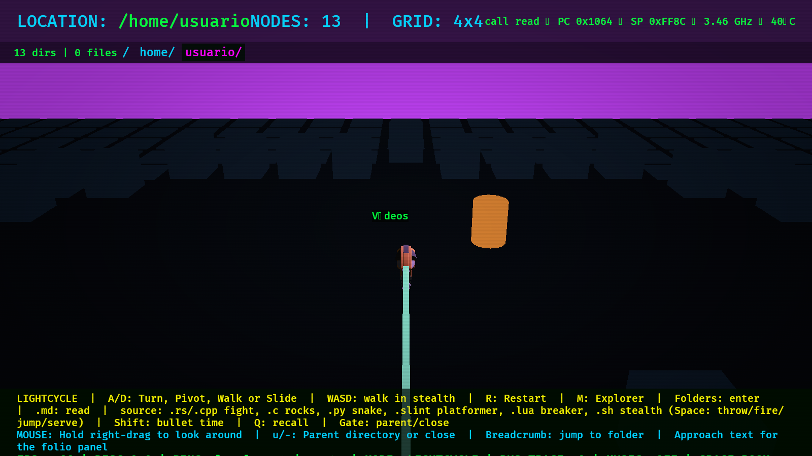
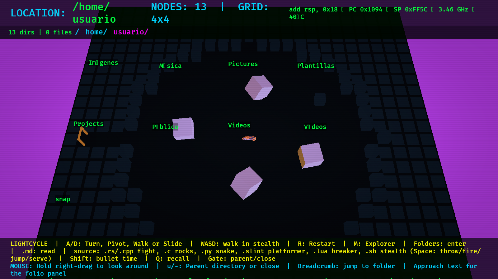
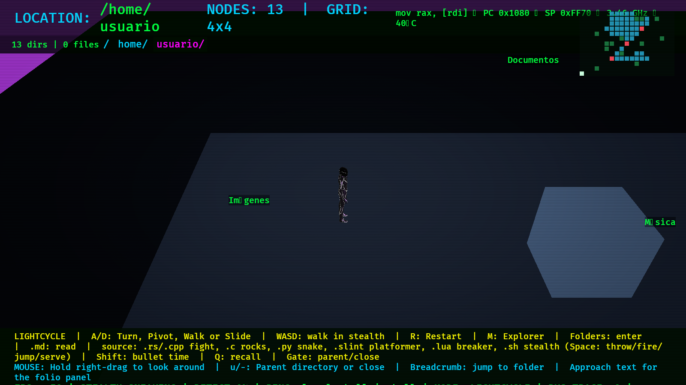

# Arcade Minigames & File Arenas

In **LIGHTRIDER**, source files are not just static obstacles. Riding your lightcycle into source file towers launches dedicated arcade battle rings and minigames generated from the file's own code.

You can also press **`P`** or **`Esc`** at any time to open the Pause Menu and warp directly into any minigame!

---

## Combat & Arena Minigames

### 1. Disc Wars (`.rs`, `.cpp`)

* **Aesthetic**: Classic TRON gladiatorial ring against an AI-controlled Recognizer opponent.
* **Code-Generated Layout**: Functions raise gallery alcoves, tests become recharging safe zones, and keywords become tactical pickups (e.g. `TODO` grants a wall-phasing disc, `async` grants throw range, `match` splits discs upon impact, `panic!` equips a lethal spike).
* **Controls**:
  * `Space` / Left Click → Throw disc (auto-aims towards opponent).
  * `Q` → Recall disc.
  * Hold `Shift` → **Bullet Time** (slows time to 40% to calculate angles).
* **Rules**: Best 2 out of 3 rounds. Win to unlock the exit portal.

### 2. Asteroid Field (`.c`, `.h`)

* **Aesthetic**: Classic vector arcade asteroid shooter.
* **Controls**:
  * `A` / `D` or Arrow keys → Pivot parked cycle in place.
  * `Space` / Left Click → Fire energy beam.
  * Hold `Shift` → Bullet time.
* **Rules**: Large rocks split into medium and small fragments. Clear all rocks across 3 lives to survive.

### 3. Snake (`.py`, `.pyi`)
* **Aesthetic**: Neon grid snake challenge.
* **Controls**: `A` / `D` or Arrow keys to steer.
* **Rules**: Power-ups are scattered across the arena based on code tokens. Eating power-ups elongates your lethal light trail. Consume all power-ups to unlock the sealed exit gate!

### 4. Side-Scrolling Platformer (`.slint`)
* **Aesthetic**: 2.5D retro cyber platformer.
* **Controls**: `A` / `D` to run, `Space` to jump.
* **Rules**: Leap across floating platforms and hazards generated from UI markup to reach the exit door.

### 5. Brick Breaker (`.lua`)
* **Aesthetic**: Vertical Breakout arena.
* **Controls**: `A` / `D` to slide the lightcycle paddle, `Space` to serve the ball.
* **Rules**: Rebound the energy sphere off your bike to shatter the brick matrix overhead.

### 6. Stealth Infiltration (`.sh`)

* **Aesthetic**: Third-person tactical stealth espionage.
* **Controls**:
  * `WASD` or Arrow keys → Walk and sneak.
  * Hold into wall → Peek around corner.
* **Mechanics**: Patrolling guards cast dynamic vision cones. Line-of-sight is blocked by solid cover. Sneak through shadows to reach the extraction door before your detection meter fills!

### 7. River Surfer (`.toml`)
* **Aesthetic**: Jet-Moto style high-speed hoverbike canyon race.
* **Controls**: `A` / `D` to steer, hold `Space` / `W` / `Up` to boost.
* **Rules**: Dodge rocks, thread floating boost rings, and cross the finish line without beaching onto canyon banks.

### 8. Galaga (`.json`)
* **Aesthetic**: Fixed-screen space shooter.
* **Controls**: `A` / `D` to slide cycle along the baseline, `Space` / Click to fire upward.
* **Rules**: Shoot down the swaying, diving insectoid formations before they descend onto your position.

---

## The Arcade Block

Fixed-screen arcade classics mapped to additional file formats:

| File Type | Game | Objective |
| :--- | :--- | :--- |
| **`.go`** | **Pac-Man** | Navigate corridors, gobble pellets, and evade 3 garbage-collector ghosts. |
| **`.rb`** | **Columns** | Slide and cycle falling gem trios to match 3-in-a-row horizontally, vertically, or diagonally. |
| **`.yaml` / `.yml`** | **Tetris** | Stack and clear 10 lines of indented code blocks before the well tops out. |
| **`.js`** | **Frogger** | Hop across five perilous lanes of moving code packets to reach the safety docks. |
| **`.zig`** | **Q*bert** | Hop diagonally across an isometric cube pyramid to illuminate every tile while avoiding enemies. |
| **`.php`** | **Bomberman** | Plant cross-exploding plasma bombs (`Space`) to blast crates, clear foes, and reach the exit. |
| **`.r`** | **Plinko** | Drop balls through seeded pin pegboards into scored buckets to beat the target quota. |
