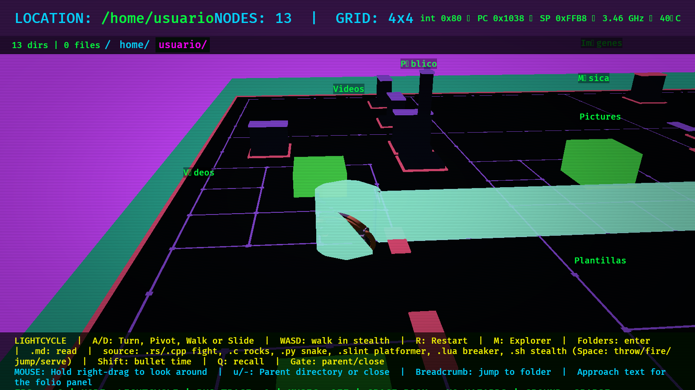

# Lightcycle Mode & Cyber-City Architecture

Press **`M`** anywhere in the 3D explorer to toggle between the classic filesystem view and **Lightcycle Mode** — riding a sleek cyber-bike through a living city generated from your directories.

---

## The Satellite Transition

Switching modes does not cut or pop the camera; it zooms smoothly through a satellite-style transition:
* The camera pulls back off its current rig until the entire folder city is visible below.
* As the camera climbs, the leaving scene gracefully sinks into the floor.
* At the apex of the climb, a cyan rez wave sweeps across the plane as the new city rises.
* The camera plunges down onto your starting street, landing seamlessly right behind the cycle as its engine revs up.

---

## Driving & Physics

* **Continuous Grid Traversal**: The cycle moves continuously between cell centers; turns are queued with `A` / `D` (or arrow keys) and execute cleanly at boundaries.
* **Liquid-Glass PCB Trail**: The cycle leaves a persistent, glowing wall streaming off its tail, thickening to full height shortly behind the bike. Crossing your own trail is fatal!
* **Free Look Camera**: Hold **Right Mouse Button** and drag to swing the chase camera around the bike and look up/down. Releasing springs the camera back behind your shoulder.
* **Guaranteed Runway**: Spawning always selects a starting cell and heading with at least six empty cells in a straight line ahead, giving you time to read the streets.
* **Parent Gate**: Every directory arena features a pulsing golden gate cut into the perimeter wall. Riding through it navigates you up to the parent directory.

---

## City Generation

Every folder is mapped into a path-seeded TRON district:
* **Road Network**: The generator lays connected arterial boulevards, tower plazas, and perimeter highways before placing any buildings.
* **Districts**: Color palettes (Cyan, Magenta, Violet, and Amber) are deterministically derived from the directory path.
* **Downtown Plazas**: File and directory towers are situated in open 3×3 plazas.
* **Geometry Batching**: Static structures are merged into batched materials with capped instance counts to ensure butter-smooth 60+ FPS even in folders with tens of thousands of entries.

---

## Document Page Arenas (`.md` / `.markdown`)

Riding into a Markdown file tower pauses the city run and enters a **Page Arena**:
* **The Reading Spine**: Instead of a downtown skyline, the arena transforms into a ruled page floor, ink paragraph walls, and heading arches.
* **Folio Inspection**: Approaching any heading or paragraph opens a folio panel displaying the full formatted Unicode text.
* **Exiting**: Ride through the folio gate or press `u` / `-` to close the file and return instantly to the directory city without re-scanning disk.

---

## Inside the Machine: Architectural Metaphors

The Lightcycle grid immerses the player inside computer architecture:

* **Hex-Dump Highway**: Roads carry sampled byte streams as emissive data plates. Districts pick from five procedural layouts (dotted, dashed, clustered plazas, square rings, or sparse pads).
* **Call Stack**: Floating frames hover above the arena perimeter, visually representing directory depth (e.g. `/home/user/project` floats 3 frames deep) and plunging synchronously.
* **Garbage Collector Sweep**: Periodic GC sweeps send bright scanlines across the arena accompanied by brief simulated processing stumbles.
* **Memory Flood Wall**: After a grace period, a red spilled-memory wall rises from one edge and creeps forward. Outrun it or be derezzed in a buffer overflow!
* **Quarantine Vaults**: Heavy or build directories (`node_modules`, `.git`, `target`, `vendor`, `__pycache__`) open as quarantined hazard vaults with elevated warning pylons and accelerated flood timers.
* **Git Time Machine**: Navigation forms a commit history. Press `Z` to rewind to previously visited directories and `Y` to fast-forward through the redo branch.
