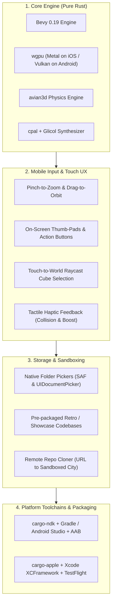
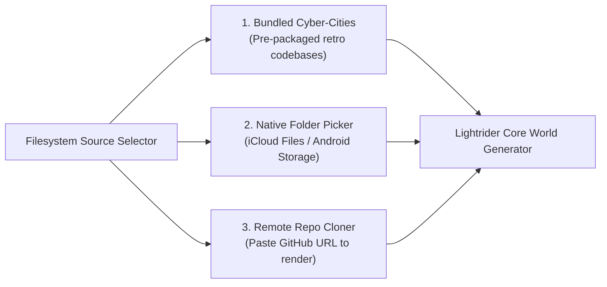
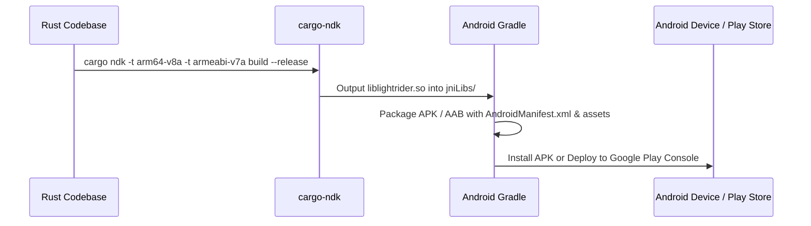
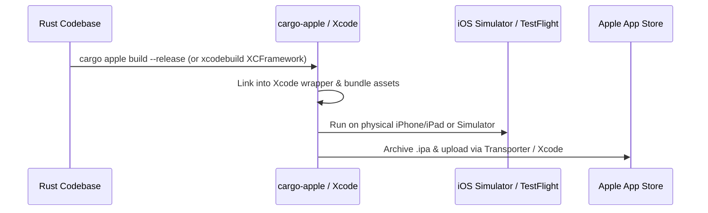
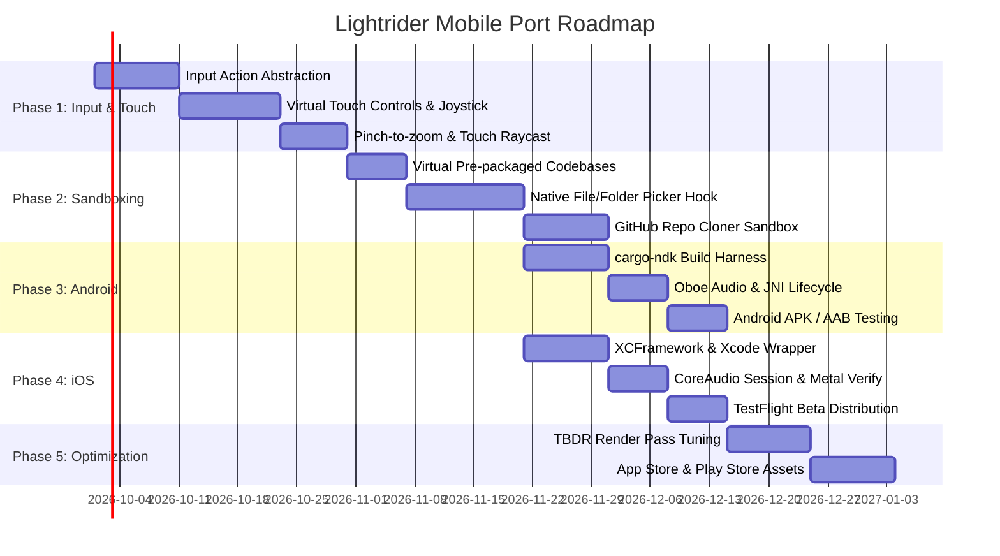

# LIGHTRIDER — Mobile Port Plan (Android & iOS)

**Status:** Proposed Architecture & Roadmap  
**Target Engines:** Bevy 0.19, wgpu, avian3d, cpal, glicol  
**Target Platforms:** Android (API 26+, ARM64 / ARMv7), iOS (15.0+, Apple Silicon / ARM64)  
**Last Updated:** 2026-09-14  

---

## 1. Executive Summary & Vision

**LIGHTRIDER** is currently a desktop-first cyber-grid filesystem navigator and TRON arcade built with Rust and Bevy. Porting Lightrider to **iOS** and **Android** opens up an immersive tactile experience: exploring codebases with pinch-to-zoom, steering lightcycles with responsive thumb-swipes, and battling through arcade source-code arenas on tablets and smartphones.

Because the underlying engine stack (**Bevy 0.19**, **avian3d**, **wgpu**, **cpal**, and **glicol**) is pure Rust and cross-platform, the rendering, physics, and audio engines can run natively on mobile hardware without rewriting gameplay code. The primary architectural changes focus on **filesystem sandboxing**, **touch-first input abstraction**, **mobile GPU thermal management**, and **store-compliant platform packaging**.

---

## 2. Architectural Pillars



---

## 3. Pillar 1: Filesystem Sandboxing & Virtual Repositories

### The Mobile Paradigm Shift
On Linux, macOS, and Windows, desktop Lightrider directly scans arbitrary host paths (`/`, `C:\`, `/home/usuario/`) and invokes OS file managers (`open_file`, child processes). Mobile operating systems operate in strict isolation:
* **iOS App Sandbox**: Apps cannot traverse the host directory tree. An app can only read its isolated `Documents/` and `Caches/` directories, or user-selected folders accessed via security-scoped bookmarks (`UIDocumentPickerViewController`).
* **Android Scoped Storage (Android 11+)**: Raw filesystem paths are restricted. Access to external directories requires the **Storage Access Framework (SAF)** via `ACTION_OPEN_DOCUMENT_TREE`.

### Solution Architecture
To make Lightrider fun and immediately playable out of the box on mobile, three distinct content sources will be supported:



1. **Bundled Retro Cyber-Cities (Out-of-the-box)**:
   - Ship the mobile app with 2–3 curated open-source projects or retro text archives bundled directly inside the app assets (e.g. classic arcade source code, Jurassic Park UNIX scripts, demo Rust repos).
   - Allows instant gameplay without requiring the user to grant storage permissions on first launch.
2. **Native Folder Import**:
   - **iOS**: Integrate `UIDocumentPickerViewController` to let users pick any folder from iCloud Drive or On My iPhone. Store a persistent security-scoped bookmark to retain access across sessions.
   - **Android**: Launch `Intent(Intent.ACTION_OPEN_DOCUMENT_TREE)` via JNI, using `DocumentFile` to enumerate child files into Lightrider's `DirectoryTree`.
3. **The "GitHub Explorer" Mode**:
   - Allow users to paste a public repository URL (e.g. `github.com/leftger/lightrider`).
   - Shallow-clone or download the zip archive into the app's local sandbox and transform their personal repository into a living 3D TRON city.

---

## 4. Pillar 2: Touch Controls & Input Abstraction

### Decoupling Keyboards from Actions
Currently, game systems read concrete `KeyCode` values (e.g. `KeyCode::KeyA`, `KeyCode::Space`). We will introduce an abstract action layer:

```rust
#[derive(Actionlike, PartialEq, Eq, Clone, Copy, Hash, Debug, Reflect)]
pub enum PlayerAction {
    SteerLeft,
    SteerRight,
    Accelerate,
    Brake,
    FireDisc,
    RecallDisc,
    BulletTime,
    ToggleMode,
    PauseMenu,
}
```

### On-Screen Virtual Controls
1. **Lightcycle Mode**:
   - **Left Thumb Zone**: Floating or fixed virtual thumb-slider for queued 90° boundary turns.
   - **Right Thumb Zone**: Transparent neon action button for Turbo Boost / Bullet Time.
2. **Arcade Minigames**:
   - **Disc Wars**: Drag to aim target reticle, release to fling identity disc.
   - **Stealth**: Virtual floating analog joystick for smooth 360° walking and cover hugging.
   - **Asteroids / Galaga**: Left/right tap zones and autofire toggle button.
3. **Camera & Cube Selection**:
   - **One-finger swipe**: Smooth orbit rotation (`bevy::input::touch::Touch`).
   - **Two-finger pinch**: Zoom in / zoom out.
   - **Single tap on 3D Block**: Cast ray from viewport touch coordinates into the scene to select, preview, or inspect file nodes.
   - **Double tap**: Enter directory or launch arcade battle.

---

## 5. Pillar 3: Rendering & Audio Performance on Mobile

Mobile chipsets utilize **Tile-Based Deferred Rendering (TBDR)**. Unconstrained desktop rendering loops can cause rapid thermal throttling and battery drain.

### Graphics & Performance Strategy
* **Target Framerate**: Default to 60 FPS on modern devices, with a 30 FPS / Battery Saver toggle in the config menu.
* **Bloom Optimization**: Reduce bloom blur passes from 5 down to 3 on mobile GPUs, or switch to lightweight threshold-based post-processing.
* **Dynamic LOD & Plaza Capping**: Scale down max rendered city blocks dynamically based on target GPU tier (e.g., cap visible building entities to 1,500 on mid-range Android vs 5,000 on desktop).
* **MSAA**: Limit MSAA to 2x (or disable on low-end Mali GPUs in favor of fast FXAA).

### Audio Lifecycle Handling
* **Android**: `cpal` with **AAudio / Oboe** low-latency backend. Manage audio suspension on Android activity `onPause()` to eliminate battery drain when backgrounded.
* **iOS**: `cpal` using **CoreAudio**. Configure `AVAudioSessionCategoryAmbient` so background audio (e.g. Spotify) can optionally mix with or be overridden by Lightrider's Glicol synthesizer. Handle phone call interruptions cleanly via CoreAudio callbacks.

---

## 6. Pillar 4: Toolchains & Deployment Pipeline

### 🤖 Android Pipeline



1. **Rust Targets**:
   ```bash
   rustup target add aarch64-linux-android armv7-linux-androideabi x86_64-linux-android
   ```
2. **Build Tool**: Use [`cargo-ndk`](https://github.com/bbqsrc/cargo-ndk) to compile native `.so` shared libraries for all target ABIs.
3. **Android Studio / Gradle Shell**:
   - A standard Android project containing a `NativeActivity` or custom `Activity`.
   - `AndroidManifest.xml` configuring `android.permission.READ_EXTERNAL_STORAGE` (for legacy devices) and SAF permissions.
4. **Google Play Publishing**:
   - Generate release keystore for app signing.
   - Output `.aab` (Android App Bundle) targeting 64-bit architecture requirements.

---

### 🍏 iOS Pipeline



1. **Rust Targets**:
   ```bash
   rustup target add aarch64-apple-ios aarch64-apple-ios-sim
   ```
2. **Build Architecture**:
   - Compile Rust crate as a static library (`crate-type = ["staticlib"]`) or use `cargo-apple`.
   - Wrap into a universal `Lightrider.xcframework` supporting both physical iOS hardware (`aarch64-apple-ios`) and macOS iOS Simulators (`aarch64-apple-ios-sim`).
3. **Xcode Project Configuration**:
   - `Info.plist`: Set supported orientations (Landscape Left / Landscape Right), camera/motion usage strings, and `UIFileSharingEnabled`.
   - App Icons & Asset Catalog (`Assets.xcassets`).
4. **App Store Publishing**:
   - Apple Developer Program membership ($99/year).
   - Code signing certificates and provisioning profiles.
   - TestFlight beta distribution for external tester feedback.

---

## 7. Phased Implementation Roadmap



### Detailed Breakdown

#### Phase 1: Input Abstraction & Touch Controls
- [ ] Refactor `src/plugins/lightcycle/input.rs` and minigame input systems to consume abstract actions instead of direct `KeyCode` inputs.
- [ ] Implement a Bevy UI touch overlay plugin (`TouchControlsPlugin`) rendering on-screen virtual steering buttons and turbo triggers.
- [ ] Implement two-finger pinch-to-zoom and drag-to-orbit camera navigation using `bevy::input::touch::Touches`.
- [ ] Implement touch screen-space raycasting for 3D directory block picking.

#### Phase 2: Storage Sandboxing & Folder Pickers
- [ ] Implement `StorageSource` abstraction: `LocalPath(PathBuf)`, `Bundled(AssetPath)`, `VirtualRepo(String)`.
- [ ] Include bundled starter directories inside `assets/sample_repos/` for immediate out-of-the-box play.
- [ ] Integrate cross-platform file picker bindings (e.g. `rfd` or platform-native SAF / UIDocumentPicker) for custom folder inspection.

#### Phase 3: Android Platformization
- [ ] Setup `cargo-ndk` build script in `tools/build-android.sh`.
- [ ] Create `android/` Gradle project with `NativeActivity` and `AndroidManifest.xml`.
- [ ] Verify `cpal` low-latency audio via AAudio/Oboe backend on Android device.
- [ ] Add touch back-button and lifecycle suspension handling.

#### Phase 4: iOS Platformization
- [ ] Setup Xcode project in `ios/Lightrider.xcodeproj`.
- [ ] Create `tools/build-ios.sh` generating `Lightrider.xcframework`.
- [ ] Verify Metal rendering and CoreAudio session activation on physical iPhone / iPad.
- [ ] Deploy initial build to Apple TestFlight.

#### Phase 5: Mobile Optimization & Store Launch
- [ ] Implement thermal and battery profiles (30 FPS power-save mode, scaled bloom passes).
- [ ] Capture App Store and Google Play screenshots and promotional videos.
- [ ] Submit for Google Play Store and Apple App Store review.

---

## 8. Risk Matrix & Mitigations

| Risk | Impact | Likelihood | Mitigation |
| :--- | :---: | :---: | :--- |
| **App Sandbox Limits User Files** | High | High | Ship with rich pre-packaged cyber-cities and add a one-click GitHub repo URL cloner mode. |
| **Mobile Thermal Throttling** | High | Medium | Add configurable graphic presets (Bloom LOD, entity draw distance capping, 30/60 FPS toggle). |
| **Audio Latency / Crackling** | Medium | Medium | Use `cpal`'s AAudio backend on Android and CoreAudio on iOS with conservative ring buffer sizing. |
| **Touch Controls Feel Clunky** | High | Medium | Provide generous touch hitboxes, visual press feedback, and support Bluetooth gamepad controllers (`bevy_gilrs`). |
| **App Store Review Rejection** | Medium | Low | Ensure compliance with Apple App Store Review Guidelines (clear storage descriptions in `Info.plist`, no unauthorized code execution). |
